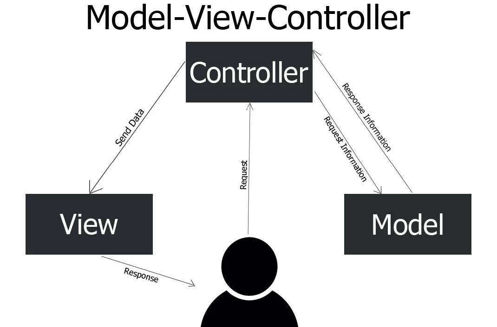

# Model-View-Controller

Когда вы начинаете разрабатывать веб-приложение, важно понимать, как будут устроены его "внутренности". Нужно заранее продумать организацию кода в директориях, определить, какие файлы будут в них находиться и как они будут взаимодействовать друг с другом.

Очевидно, что для создания крупного веб-приложения одного файла `index.php` в корневой директории недостаточно. Код необходимо разделить на логические части, чтобы его было проще понимать, поддерживать и тестировать.

Существует множество шаблонов проектирования веб-приложений. Один из самых популярных — это паттерн **MVC** (Model-View-Controller).

> [!NOTE]
> **Паттерн (шаблон)** — это способ проектирования, который предлагает решение типичной проблемы в программировании. Паттерны помогают разработчикам понять, как организовать код, чтобы он был более читаемым, поддерживаемым и масштабируемым.

## Что такое MVC?

**MVC** — это аббревиатура, означающая **Model-View-Controller** (Модель - Представление - Контроллер). Этот паттерн проектирования, который разделяет приложение на три основных компонента [^1]:
- **Модель (Model)** — отвечает за работу с данными. Она содержит логику взаимодействия с базой данных, валидацию данных и другие операции, связанные с данными.
- **Представление (View)** — отвечает за отображение данных пользователю. Оно содержит HTML-код, CSS-стили и другие элементы, необходимые для визуализации данных.
- **Контроллер (Controller)** — обрабатывает запросы пользователя и управляет данными. Он получает запрос от пользователя, обращается к модели для получения данных, передает данные в представление и возвращает результат пользователю.

 [^1]

Простыми словами, мы разделяем наш код на 3 основные части: часть, отвечающая за данные (Модель), часть, отвечающая за отображение данных (Представление), обычно это шаблоны HTML, и часть, отвечающая за обработку запросов и управление данными (Контроллер).

## Пример реализации MVC

Давайте рассмотрим пример простого веб-приложения, реализованного с использованием паттерна MVC. 

Предположим, что у нас есть **простое приложение для управления списком задач**. Пользователь может добавлять, редактировать и удалять задачи.

Рассмотрим, как можно организовать код приложения с использованием паттерна MVC.

### Модель (Model)

Модель отвечает за работу с данными. 

В нашем примере модель будет представлять собой класс `Task`, который будет содержать информацию о задаче (например, название и описание) и методы для работы с задачами (например, добавление, редактирование и удаление задач).

## Представление (View)

Представление отвечает за отображение данных пользователю.

В нашем примере представление будет представлять собой шаблоны HTML, которые будут отображать список задач, отдельную задачу и форму для добавления/редактирования задач.

### Контроллер (Controller)

Контроллер отвечает за обработку запросов пользователя и управление данными.

В нашем примере контроллер будет представлять собой класс `TaskController`, который будет содержать методы для обработки запросов (например, отображение списка задач, добавление, редактирование и удаление задач).

Когда пользователь отправляет запрос на добавление задачи, выполняется метод `addTask` контроллера, который добавляет задачу в базу данных и перенаправляет пользователя на страницу со списком задач.

> [!NOTE]
> Как вы могли заметить, контроллер является сердцем приложения и обеспечивает взаимодействие между моделью и представлением.

В контексте MVC, контроллер можно считать точкой входа в приложение. Он получает запрос от пользователя, обращается к модели для получения данных, передает данные в представление и возвращает результат пользователю.

## Почему мы говорим о MVC?

В рамках нашего курса мы будем изучать фреймворк `Laravel`, который использует паттерн MVC для организации кода.  К тому же, паттерн MVC является одним из самых популярных и широко используется в остальных фреймворках и библиотеках для разработки веб-приложений (PHP: Symfony, Yii, CodeIgniter; Python: Django; Java: Spring Framework; Ruby: Ruby on Rails и т.д.).

Без понимания данного паттерна будет сложно понять, как устроены фреймворки и как организован код внутри них.

[^1]: Модель-Представление-Контроллер (MVC), proglike [online]. Available: https://proglike.ru/news/model-predstavlenie-kontroller.