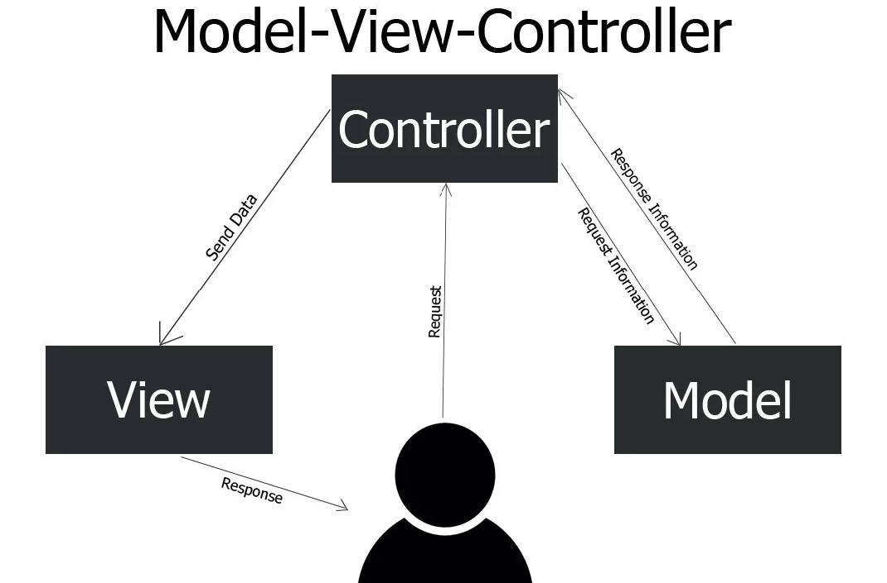

# Model-View-Controller

Când începeți să dezvoltați o aplicație web, este important să vă gândiți la modul în care va fi organizat codul acesteia. Aceasta ajută la evitarea dezordinii și la facilitarea întreținerii proiectului. Utilizarea unui singur fișier `index.php` în directorul principal nu este potrivită pentru aplicațiile mari. În schimb, codul trebuie împărțit în părți logice.

Unul dintre cele mai populare modele este **MVC** (Model-View-Controller).

> [!NOTE]  
> **Modelul (pattern)** este o soluție gata făcută pentru o problemă tipică de programare, care ajută la organizarea codului, făcându-l mai structurat și mai ușor de întreținut și scalabil.

## Ce este MVC?

**MVC** este o abreviere de la **Model-View-Controller** (Model - Vedere - Controler), un model de proiectare care împarte aplicația în trei componente principale [^1]:
- **Modelul (Model)** — se ocupă de date și logică de afaceri. Interacționează cu baza de date și conține logica de manipulare a datelor, validare și alte operațiuni legate de informații.
- **Vederea (View)** — este responsabilă de afișarea datelor utilizatorului. Poate include HTML, CSS, JavaScript și alte elemente necesare pentru vizualizarea informațiilor.
- **Controlerul (Controller)** — gestionează interacțiunea dintre utilizator și sistem. Acesta primește cererile, apelează modelul necesar pentru a procesa datele și trimite rezultatul către vedere pentru afișare.

 [^1]

Pe scurt, modelul MVC împarte codul în trei părți principale:
- **Modelul** gestionează datele,
- **Vederea** afișează datele,
- **Controlerul** le leagă, procesând cererile utilizatorului și trimițând datele către modelul sau vederea corespunzătoare.

## Exemplu de implementare MVC

Să analizăm un exemplu simplu de aplicație web pentru gestionarea sarcinilor, care utilizează modelul MVC.

### Modelul (Model)

Modelul este responsabil pentru lucrul cu datele. În exemplul nostru, modelul este clasa `Task`, care stochează informații despre sarcini (titlu, descriere) și metodele pentru gestionarea acestora.

```php
class Task
{
    private $id;
    private $title;
    private $description;

    public function __construct($id, $title, $description) {
        $this->id = $id;
        $this->title = $title;
        $this->description = $description;
    }
}
```

## Vizualizarea (View)

Vizualizarea este responsabilă pentru afișarea datelor utilizatorului.

În exemplul nostru, vizualizarea va reprezenta șabloane HTML care vor afișa lista de sarcini, o sarcină individuală și un formular pentru adăugarea/editarea sarcinilor.

```html
<!-- views/tasks.php -->
<!DOCTYPE html>
<html lang="ro">
<head>
    <meta charset="UTF-8">
    <title>Sarcini</title>
</head>
<body>
    <h1>Sarcini</h1>
    <ul>
        <?php foreach ($tasks as $task): ?>
            <li>
                <strong><?php echo $task->title; ?></strong>
                <p><?php echo $task->description; ?></p>
            </li>
        <?php endforeach; ?>
    </ul>
</body>
</html>
```

### Controlerul (Controller)

Controlerul este responsabil pentru procesarea cererilor utilizatorului și gestionarea datelor.

În exemplul nostru, controlerul va fi clasa `TaskController`, care va conține metode pentru gestionarea cererilor (cum ar fi afișarea listei de sarcini, adăugarea, editarea și ștergerea sarcinilor).

Când utilizatorul trimite o cerere pentru a adăuga o sarcină, se va executa metoda `addTask` din controler, care adaugă sarcina în baza de date și redirecționează utilizatorul către pagina cu lista de sarcini.

> [!NOTE]  
> După cum ați observat, controlerul este inima aplicației și asigură interacțiunea dintre model și vizualizare.

În contextul MVC, controlerul poate fi considerat punctul de intrare în aplicație. El primește cererea utilizatorului, apelează modelul pentru a obține date, le trimite către vizualizare și returnează rezultatul utilizatorului.

```php
class TaskController
{
    public function index()
    {
        // Obține lista de sarcini din baza de date
        // ...

        // Afișează lista de sarcini
        include 'views/tasks.php';
    }

    public function addTask()
    {
        // Obține datele din formular
        $title = $_POST['title'];
        $description = $_POST['description'];

        // Adaugă sarcina în baza de date
        // ...

        // Redirecționează utilizatorul către pagina cu lista de sarcini
        header('Location: /tasks');
    }
}
```

## De ce discutăm despre MVC?

În cadrul acestui curs, vom studia framework-ul `Laravel`, care utilizează modelul MVC pentru organizarea codului. În plus, modelul MVC este unul dintre cele mai populare și este larg folosit în alte framework-uri și biblioteci pentru dezvoltarea aplicațiilor web (PHP: Symfony, Yii, CodeIgniter; Python: Django; Java: Spring Framework; Ruby: Ruby on Rails, etc.).

Fără o înțelegere clară a acestui model, va fi dificil să înțelegeți cum funcționează framework-urile și cum este organizat codul în interiorul lor.

[^1]: Модель-Представление-Контроллер (MVC), proglike [online]. URL: https://proglike.ru/news/model-predstavlenie-kontroller.