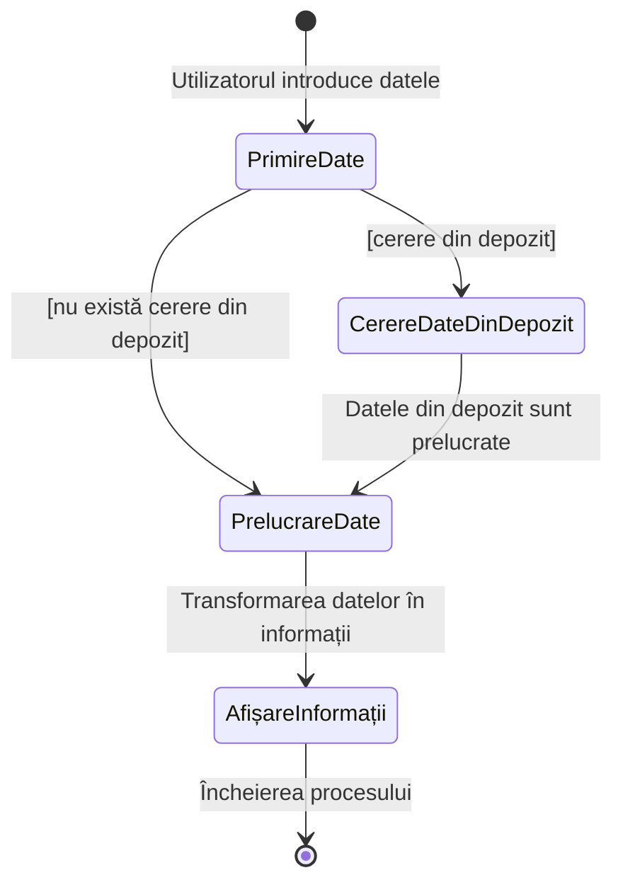

# Date și informații

Probabil că ați auzit frecvent termenii "*date*" și "*informații*". Cu toate acestea, deși îi folosim adesea în viața de zi cu zi, nu întotdeauna facem distincția clară între semnificațiile lor. Haideți să clarificăm această diferență.

Există multe opinii despre ce reprezintă datele și informațiile. Vom analiza una dintre ele.

## Ce sunt datele?

**Datele** sunt fapte brute, neprelucrate, care, în sine, nu au un sens anume. Acestea pot fi numere, texte, imagini sau alte simboluri. Datele rămân neorganizate și inutile până când sunt structurate sau analizate. **De exemplu**, o listă de numere sau nume fără explicații reprezintă doar date [^1].

## Ce sunt informațiile?

**Informațiile** sunt date care au fost prelucrate și cărora li s-a atribuit un sens. Atunci când datele sunt organizate, analizate și plasate într-un context, ele devin utile pentru înțelegere și luarea deciziilor. De exemplu, dacă luăm datele despre traficul unui site și identificăm tendințe de creștere sau scădere, aceasta este deja informație.

> [!NOTE]  
> Informațiile ajută la formularea concluziilor, dezvoltarea strategiilor și luarea deciziilor bazate pe analiză.

## Diferența dintre date și informații

Diferența principală între date și informații este că **datele** sunt doar **fapte inițiale**, în timp ce **informațiile** sunt **rezultatul prelucrării** acestora [^2].

> [!NOTE]  
> Datele sunt baza care, după analiză, se transformă în informații utile.

**Exemplu:**
- **Date**: utilizatorii unui site web.
- **Informație**: numărul de utilizatori care au vizitat site-ul în ultima lună.

## Ce se află în aplicația noastră?

Ce credeți, aplicația noastră conține date sau informații? **Răspunsul este simplu**: atât date, cât și informații. **Datele** sunt elementele de bază cu care lucrăm, iar **informațiile** sunt rezultatul prelucrării acestora.

**De exemplu**, una dintre sarcinile frecvente, dar deloc triviale, în dezvoltarea web este prelucrarea datelor furnizate de utilizator și transformarea lor în informații care pot fi afișate pe ecran.

Acest proces poate fi reprezentat astfel:

Astfel, datele și informațiile sunt interconectate și formează un sistem unitar care ne permite să creăm și să folosim aplicații.

[^1]: Data, wikipedia.org [online]. URL: https://en.wikipedia.org/wiki/Data

[^2]: Bui M, Krishen AS. Analytics from our scholarly closets: the connections between data, information, and knowledge. Journal of Marketing Analytics. 2015;3(2):1-5. doi:10.1007/s41270-017-0017-2.

[^3]: The Differences between Data, Information, and Knowledge.lisedunetwork.com [online]. URL: https://www.lisedunetwork.com/the-differences-between-data-information-and-knowledge/