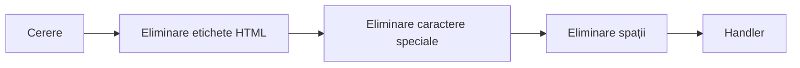

# Etapele procesării datelor în aplicațiile web

**Gestionarea datelor în aplicațiile web** reprezintă un aspect esențial, implicând procese care variază de la **recepția datelor până la stocarea și protecția acestora**. De fapt, acest subiect poate fi extins într-un curs separat, dată fiind importanța sa.

În acest capitol, vom analiza etapele cheie ale procesării datelor, inclusiv modul în care datele ajung într-o aplicație web și cum sunt gestionate corect pe parcursul ciclului lor de viață.

Datele cele mai des prelucrate sunt **datele utilizatorilor**, introduse prin formulare sau cereri API.

> [!TIP]
> În acest capitol se va folosi termenul "**handler**", care se referă la o funcție sau metodă ce prelucrează datele într-o anumită etapă. În contextul arhitecturii MVC, handler-ul este considerat a fi **controlerul** sau **metoda sa**.

## Cum ajung datele într-o aplicație web?

### Surse principale de date

1. **Introducerea datelor de către utilizatori**: utilizatorii pot introduce informații prin intermediul formularelor pe paginile web (de exemplu, înregistrare, trimiterea comentariilor).
2. **Cereri API**: datele pot fi transmise prin cereri API de la alte sisteme sau servicii.

De obicei, datele sunt transmise prin intermediul **cererilor HTTP** sau altor protocoale de transfer de date.

## Etapele procesării datelor

După ce datele ajung în aplicația web, acestea trec prin mai multe etape de procesare, cum ar fi filtrarea, validarea, verificarea accesului (autorizarea), stocarea și protecția.

### Filtrarea datelor

#### Definiție

**Filtrarea datelor** este procesul de curățare și pregătire a datelor primite înainte de a le utiliza în sistem.

**Scopul principal al filtrării** este eliminarea elementelor inutile sau potențial periculoase din date (de exemplu, caractere suplimentare, etichete HTML, cod malițios) și aducerea acestora la un format corect [^1].

#### Sarcinile principale ale filtrării datelor

- **Eliminarea caracterelor inutile**: eliminarea spațiilor, etichetelor HTML, caracterelor speciale.
- **Protecția împotriva datelor malițioase**: prevenirea injecțiilor, cum ar fi SQL Injection sau XSS (inserarea codului malițios).
- **Aducerea datelor la formatul dorit**: conversia șirurilor în numere, standardizarea datelor, formatarea textului.

#### Middleware ca un model de filtrare

Cel mai comun mod de a filtra datele în aplicațiile web este utilizarea **Middleware**.

**Middleware** este un model care permite procesarea datelor într-o etapă intermediară, între primirea cererii și transmiterea acesteia către logica principală a aplicației [^2].

În contextul filtrării datelor, middleware-ul poate servi ca un mecanism pentru prelucrarea secvențială a datelor înainte ca acestea să ajungă la handler.

**Exemplu de utilizare a Middleware în filtrare**

Să presupunem că datele primite trebuie să treacă prin mai multe etape de filtrare, cum ar fi:

1. **Eliminarea etichetelor HTML** pentru a preveni atacurile XSS.
2. **Eliminarea caracterelor speciale** pentru a preveni SQL Injection.
3. **Aducerea datelor la un format corect** (de exemplu, conversia unui șir în tip numeric).

Aceste etape pot fi realizate printr-un lanț de middleware, unde fiecare handler este responsabil pentru o parte din filtrare.

Astfel, înainte ca datele să ajungă în controler, acestea trec prin mai multe straturi de filtrare, fiecare gestionând datele la nivelul său.

#### Unde se filtrează datele?

Filtrarea datelor poate avea loc la diferite niveluri ale aplicației. Însă locul principal pentru filtrare este **Middleware**, stratul de procesare a datelor înainte de transmiterea lor către handler.

### Validarea datelor

#### Definiție

**Validarea datelor** este procesul de verificare a datelor pentru conformitatea cu anumite reguli înainte de utilizare sau stocare [^1].

Dacă filtrarea elimină elementele nedorite, validarea verifică dacă datele sunt corecte.

**De exemplu**, dacă se așteaptă ca utilizatorul să introducă o adresă de e-mail, filtrarea poate curăța caracterele inutile, iar validarea va verifica dacă adresa introdusă respectă standardele unui e-mail.

#### Sarcinile principale ale validării

- **Verificarea formatului**: asigurarea că datele respectă formatul așteptat (de exemplu, validarea unui e-mail).
- **Verificarea câmpurilor obligatorii**: verificarea prezenței tuturor datelor obligatorii.
- **Verificarea intervalelor**: asigurarea că datele se încadrează în intervalele permise (de exemplu, vârsta între 18 și 65 de ani).

Exemple de validare includ verificarea formatelor de date, adreselor de e-mail sau unicitatea datelor.

#### Unde se validează datele?

Validarea datelor are loc de obicei după filtrare și înainte de stocarea acestora în baza de date. Aceasta poate fi implementată în handler sau în straturile de prelucrare a datelor.

### Verificarea accesului (Autorizare)

#### Definiție

**Autorizarea** este procesul de verificare a drepturilor utilizatorului sau ale sistemului de a accesa anumite date sau de a efectua anumite acțiuni [^3].

Aceasta se face după autentificarea (verificarea identității utilizatorului) și servește pentru a limita accesul la resurse în funcție de drepturi.

#### De ce este necesară autorizarea?

Autorizarea garantează că doar utilizatorii autorizați pot vizualiza, modifica sau șterge datele. Acest lucru ajută la prevenirea accesului neautorizat și protejează atât datele utilizatorilor, cât și aplicația însăși.

#### Cum funcționează autorizarea?

Autorizarea poate fi realizată prin mai multe mecanisme:
1. **Roluri și drepturi**: utilizatorilor li se atribuie roluri (de exemplu, administrator, editor, utilizator), iar fiecărui rol îi sunt asociate anumite drepturi de acces la date.
2. **Politici de acces**: un mecanism mai flexibil care permite alocarea drepturilor de acces la date în funcție de context (de exemplu, doar proprietarul datelor le poate edita, iar alți utilizatori le pot doar vizualiza).

#### Unde se verifică accesul?

Verificarea accesului are loc de obicei înainte de procesarea cererii sau înainte de afișarea datelor către utilizator. 

Se recomandă frecvent să se efectueze verificarea accesului în **middleware**. Astfel, înainte ca cererea să ajungă în handler, aceasta trece prin verificarea accesului la operația solicitată.

### Handlerele cererilor (Controlerele)

După ce datele ajung într-o aplicație web, acestea trec printr-un **handler de cerere** (în arhitectura MVC — controler), care gestionează procesarea datelor la nivelul aplicației.

Controlerul îndeplinește următoarele acțiuni principale:

1. **Recepționarea datelor**: Controlerul primește datele din cerere, fie ele trimise de utilizator sau de un sistem extern.
   
2. **Procesarea logicii de afaceri**: Controlerul decide cum să gestioneze datele. De exemplu, verifică autorizarea utilizatorului, execută validarea sau transmite datele modelului pentru interacțiunea cu baza de date.

3. **Interacțiunea cu modelul**: Controlerul interacționează cu modelul pentru a efectua operații cu datele, cum ar fi stocarea, actualizarea sau extragerea acestora din baza de date.

4. **Formarea răspunsului**: După executarea tuturor operațiunilor, controlerul returnează rezultatul utilizatorului. Acesta poate fi o pagină HTML sau un răspuns JSON în cazul unui API.

Astfel, controlerul joacă un rol esențial în procesarea datelor, asigurând transferul între utilizator, model și vizualizare, gestionând în același timp logica de afaceri.

### Stocarea

 datelor

După ce datele ajung în handler, uneori trebuie să le stocăm pentru utilizare ulterioară. În funcție de tipul de date prelucrate, acestea pot fi stocate în diverse locații, cum ar fi:
- *Baza de date*
- *Sistemul de fișiere*
- *Cache-ul*

#### Definiție

**Stocarea datelor** reprezintă procesul de scriere a datelor într-un depozit pe termen lung pentru utilizare ulterioară. Acest depozit poate fi o bază de date, un sistem de fișiere sau un depozit în cloud.

### Protecția datelor

Protecția datelor implică măsuri pentru prevenirea accesului neautorizat și a scurgerilor de informații.

#### Principalele aspecte ale protecției datelor

1. **Criptare**: protejarea datelor în timpul transferului și stocării (de exemplu, utilizarea HTTPS pentru transmiterea datelor sau criptarea parolelor în baza de date).
2. **Controlul accesului**: utilizarea autorizării pentru restricționarea drepturilor de acces la date.
3. **Jurnalizare și audit**: înregistrarea tuturor acțiunilor legate de accesul la date pentru prevenirea scurgerilor și încălcărilor de securitate.

### Afișarea datelor

După procesarea și stocarea datelor, acestea pot fi afișate utilizatorului.

**Afișarea datelor** reprezintă procesul de prezentare a datelor într-un format ușor de utilizat. Acesta poate include tabele, grafice, diagrame sau alte elemente de interfață.

## Concluzie

În general, aplicația noastră poate fi descrisă ca o secvență de etape de procesare a datelor, fiecare dintre acestea jucând un rol crucial în asigurarea securității și integrității informațiilor.

Urmând aceste etape, putem asigura o procesare sigură și eficientă a datelor în aplicațiile web, prevenind astfel numeroase probleme legate de securitatea și integritatea datelor.

[^1]: Aljawarneh S, Alkhateeb F, Maghayreh EA. A Semantic Data Validation Service for Web Applications. Journal of Theoretical and Applied Electronic Commerce Research. 2010;5(1):39-55. doi:10.4067/S0718-18762010000100005.

[^2]: Bocciarelli P, D’Ambrogio A, Panetti T, Giglio A. E-MDAV: A Framework for Developing Data-Intensive Web Applications. Informatics. 2022;9(1):12. doi:10.3390/informatic​

[^3]: Dongjin et al. Authentication and Authorization in Microservices Architecture: A Systematic Literature Review. MDPI. 2023;12(4):78. doi:10.3390/computers12040078.