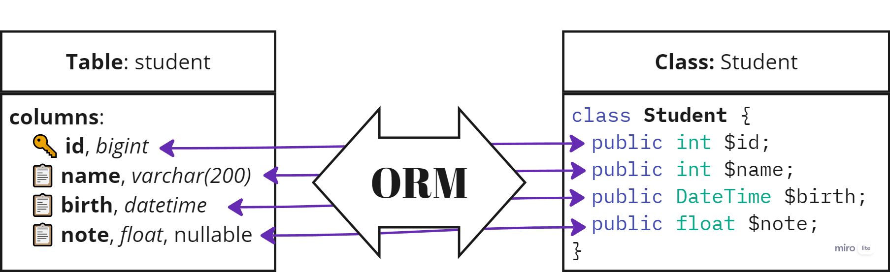

# ORM (Object-Relational Mapping)

Înainte de a trece la următoarea secțiune, să analizăm ce este ORM și de ce acest pattern este folosit pe scară largă în dezvoltarea software-ului.

**ORM** (Object-Relational Mapping) este un pattern de proiectare care permite interacțiunea cu baza de date printr-o abordare orientată pe obiecte [^1].

Cu ajutorul ORM, datele din baza de date sunt reprezentate sub formă de obiecte, ceea ce simplifică semnificativ procesul de lucru cu acestea, permițând dezvoltatorilor să utilizeze metode obișnuite din programarea orientată pe obiecte pentru a efectua operațiuni cu baza de date.

Această abordare este deosebit de populară în dezvoltarea web, deoarece majoritatea framework-urilor moderne acceptă și utilizează ORM pentru a facilita interacțiunea cu bazele de date.

## Avantaje și dezavantaje ale ORM [^2]

| Avantajele ORM                           | Dezavantajele ORM                            |
|------------------------------------------|----------------------------------------------|
| Simplifică lucrul cu baza de date         | Poate reduce performanța                     |
| Accelerează procesul de dezvoltare        | Uneori este dificil de înțeles ce se întâmplă „sub capotă” |
| Crește securitatea în manipularea datelor | Este dificil de optimizat interogările        |
| Citibilitate și întreținere mai ușoară    | Poate fi ineficient în lucrul cu volume mari de date |

## Cum funcționează ORM

Să presupunem că avem o tabelă `users` într-o bază de date:

```sql
CREATE TABLE users (
    id SERIAL PRIMARY KEY,
    name VARCHAR(255),
    email VARCHAR(255)
);
```

Pentru a obține toți utilizatorii din această tabelă, o interogare SQL standard ar arăta astfel:

```php
$users = $pdo->query('SELECT * FROM users')->fetchAll();
```

Această abordare funcționează direct cu baza de date, dar necesită prelucrarea manuală a datelor.

Cu ORM, putem reprezenta tabela `users` sub formă de obiect. În acest caz, se creează o clasă `User`, care va reprezenta fiecare rând din tabelă ca un obiect:

```php
class User
{
    public $id;
    public $name;
    public $email;
}
```

Acum, executând interogarea, vom obține obiecte ale clasei `User` în loc de array-uri de date:

```php
$users = // Obținem toți utilizatorii din baza de date

foreach ($users as $user) {
    echo $user->name; // Afișăm numele utilizatorului
}
```

Datorită ORM, lucrul cu baza de date devine mai intuitiv, deoarece manipulăm obiecte în loc de date brute, ceea ce face codul mai ușor de întreținut și mai clar.

Schematic, acest pattern poate fi reprezentat astfel:



## Mapping-ul obiectelor

Procesul de asociere a obiectelor cu datele din baza de date se numește **mapping** (mapare).

Maparea permite conversia datelor **din baza de date în obiecte și invers**.

Framework-urile ORM oferă de obicei instrumente pentru a crea aceste mapări, permițând dezvoltatorilor **să se concentreze pe logica de business a aplicației**, fără a se preocupa de detaliile interacțiunii cu baza de date.

Deși ORM are și dezavantaje, în cele mai multe cazuri **avantajele sale depășesc dezavantajele**, mai ales în cazul proiectelor mici și medii.

## Concluzie

**ORM (Object-Relational Mapping)** este un pattern esențial în dezvoltarea software-ului.

Datorită ORM, dezvoltatorii pot interacționa cu bazele de date printr-o abordare orientată pe obiecte, ceea ce simplifică interacțiunea cu datele.

Principalele avantaje ale ORM includ ușurința în utilizare, creșterea securității și accelerarea dezvoltării. Deși există anumite dezavantaje, cum ar fi reducerea performanței sau dificultatea în optimizarea interogărilor, ORM face procesul de gestionare a datelor mai simplu, făcând codul mai clar și mai ușor de întreținut.

În majoritatea cazurilor, avantajele ORM justifică utilizarea sa, în special în proiectele mici și medii, unde flexibilitatea și viteza de dezvoltare au prioritate.

[^1]: What is an ORM – The Meaning of Object Relational Mapping Database Tools, freeCodeCamp [online]. URL: https://www.freecodecamp.org/news/what-is-an-orm-the-meaning-of-object-relational-mapping-database-tools/.

[^2]: D. Torres, Cons and Pros - ORM (Object-Relational Mapping). March 26, 2023 [online]. URL: https://www.linkedin.com/pulse/cons-pros-orm-object-relational-mapping-daniel-torres/