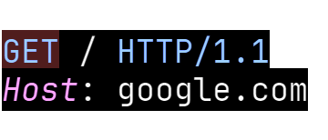
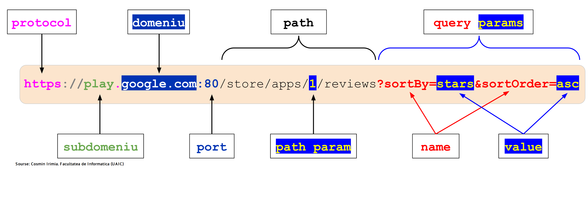
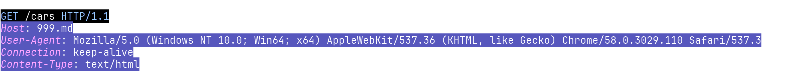

# Что такое HTTP?

Первым и самым важным аспектом веб-разработки является протокол **HTTP**. Скорее всего, вы часто слышали об этих "магических" четырех буквах, но что же они означают?

На первый взгляд, понять, что такое HTTP будет сложно, но мы попробуем разложить это понятие на составляющие и привести примеры, чтобы вам было легче понять.

Для того чтобы устройства в компьютерной сети могли понимать друг друга, существуют специальные правила, определяющие формат взаимодействия. Эти правила называются протоколами, и одним из них является **HTTP** [^3].

## HTTP - это протокол

**HTTP** – это широко распространенный протокол передачи гипертекста (HyperText Transfer Protocol).

**Гипертекст** — это текст, в котором есть ссылки на другие тексты. Например, когда вы читаете статью в интернете и видите слово, на которое можно нажать, чтобы перейти на другую страницу.

**Протокол** – это набор правил и соглашений, которые определяют, как устройства общаются друг с другом. В случае _HTTP_ это означает, что сервер и клиент общаются между собой по определенным правилам [^1].

> [!NOTE]
> Основная версия протокола, которая используется сейчас, — это HTTP 1.1.

А по каким именно правилам происходит общение между сервером и клиентом? Рассмотрим это подробнее.

## HTTP – Запросы и Ответы

Когда вы заходите на веб-сайт, ваш браузер отправляет запрос на сервер, который затем отвечает на этот запрос, предоставляя содержимое сайта. Эта коммуникация осуществляется по протоколу _HTTP_ (или простыми словами по правилам _HTTP_).

[^2]

### Что такое HTTP-запрос? [^3]

**HTTP-запрос** (_en. HTTP request_) – это сообщение, отправляемое от клиента (например, браузера) к серверу, содержащее информацию о том, что именно клиент хочет получить.

HTTP-запрос состоит из трех частей (подробно рассмотрим их в следующих подглавах):

1. **Стартовая строка** – содержит:
   1. Метод запроса (GET, POST, PUT, DELETE и др.)
   2. URL
   3. Версию протокола
2. **Заголовки** – содержат дополнительную информацию о запросе.
3. **Тело** – содержит данные, которые клиент отправляет на сервер (например, данные формы).

Ннапример, когда вы заходите на веб-сайт **google.com**, ваш браузер отправляет серверу следующую информацию:

```http
GET / HTTP/1.1
Host: google.com
```

Когда вы заходите на веб-сайт **999.md/cars**, ваш браузер отправляет серверу `999.md` следующую строку:

```http
GET /cars HTTP/1.1
Host: 999.md
```

Это означает, что клиент хочет получить страницу с объявлениями о продаже автомобилей.

### Что такое HTTP-ответ? [^3]

**HTTP-ответ** (_en. HTTP response_) – это сообщение, которое сервер отправляет клиенту в ответ на запрос.

HTTP-ответ состоит из трех частей:

1. **Стартовая строка** – содержит
   1. Версию протокола
   2. Код состояния
   3. Текст состояния.
2. **Заголовки** – содержат дополнительную информацию об ответе.
3. **Тело** – содержит данные, которые сервер отправляет клиенту (например, HTML-код страницы).

Например, когда вы заходите на веб-сайт, сервер отправляет вашему браузеру следующую строку:

```http
HTTP/1.1 200 OK

<!DOCTYPE html>
<html>
<head>
    <title>Пример страницы</title>
</head>
<body>
    <h1>Привет, мир!</h1>
    <p>Это пример HTTP-ответа.</p>
</body>
</html>
```

Теперь подробнее рассмотрим каждую из частей запроса и ответа.

## HTTP-метод

**HTTP-метод** – это команда (действие), которую клиент отправляет серверу, указывая, что он хочет сделать. HTTP-методы определяют действия, которые сервер должен выполнить по запросу.

HTTP метод отправляется в начале строки запроса.



Существует **9** HTTP-методов, наиболее часто используемые из них:

| HTTP-метод | Цель                                   |
| ---------- | -------------------------------------- |
| **GET**    | Получить содержимое ресурса            |
| **POST**   | Создать новый ресурс                   |
| **PUT**    | Обновить существующий ресурс полностью |
| **DELETE** | Удалить ресурс                         |
| **PATCH**  | Обновить существующий ресурс частично  |

Каждый метод должен использоваться в соответствии со своим назначением. **Например**, метод `GET` предназначен для получения данных, а метод `POST` – для создания новых ресурсов. Сервер ожидает, что методы будут использоваться в соответствии с их стандартами.

> [!IMPORTANT]
> Важно понимать, что метод — это всего лишь информация для сервера. Вы можете написать серверный код так, чтобы он выполнял нестандартные действия для методов (например, чтобы метод `DELETE` создавал ресурсы). Однако это нарушит стандарты и может вызвать проблемы совместимости с другими серверами и клиентами. _Представьте, что вы пришли в автосервис с просьбой починить машину, а её вместо этого отвезли на металлолом_.

Примеры:

```http
// Клиент хочет получить страницу
// с объявлениями о продаже автомобилей
GET /cars HTTP/1.1
```

```http
// Клиент хочет создать новое объявление о продаже автомобиля
POST /cars HTTP/1.1
```

```http
// Клиент хочет удалить объявление
// о продаже с идентификатором 123
DELETE /cars/123 HTTP/1.1
```

## URL

**URL (Uniform Resource Locator)** - это адрес, который идентифицирует ресурс в сети Интернет. Он указывает на местонахождение ресурса и определяет, каким образом можно получить к нему доступ [^7].

URL указывается после HTTP-метода.


URL состоит из следующих компонентов:

| Название компонента | Описание | Пример |
| ------------------- | -------- | ------ |
| **Протокол** | Определяет способ передачи данных. Например, HTTP (HyperText Transfer Protocol) или HTTPS (HTTP Secure) для защищённого соединения. | `http`, `https` |
| **Субдомен (опционально)** | Часть доменного имени, которая предшествует основному домену. | `cars.999.md` (субдомен: `cars`) |
| **Домен** | Основное имя ресурса, которое используется для его идентификации. | `999.md` |
| **Порт (опционально)** | Числовой идентификатор, определяющий точку доступа на сервере. По умолчанию для HTTP используется порт `80`, а для HTTPS - порт `443`. Простыми словами, это номер двери, через который можно попасть на нужный сервис на сервере. | `80` (для HTTP), `443` (для HTTPS) |
| **Путь (опционально)** | Указывает на конкретный ресурс или страницу на сервере. | `999.md/cars/1` (путь: `/cars/1`) |
| **Query-параметры (опционально)** | Дополнительные параметры, которые передаются на сервер для обработки запроса. Они начинаются после знака "?" и разделяются амперсандом (&). Обычно используются для фильтрации. | `999.md/cars?sortBy=start&sortOrder=desc` (query-параметры: `sortBy`, `sortOrder`) |
| **Path параметр (опционально)** | Часть URL, которая используется для указания определенного ресурса. Он является неотъемлемой частью пути и обычно используется для динамической подстановки значений. | `http://999.md/cars/232` (path параметр: `232`) |

**Пример URL**:




## HTTP-заголовки

**HTTP-заголовки** (_en. headers_) – это дополнительные данные, которыми обмениваются клиент и сервер в запросах и ответах. Они содержат метаданные о запросе или ответе, помогающие серверу и клиенту правильно обрабатывать данные [^4].

HTTP-заголовки указываются ниже стартовой строки.



### Зачем нужны HTTP-заголовки?

Если бы клиент и сервер общались только с помощью методов и тела запроса, это ограничивало бы возможности обмена информацией. Иногда требуется передать дополнительные сведения, чтобы сервер или клиент могли корректно обработать данные. **Например**, заголовки могут содержать информацию о типе содержимого, кодировке, cookie и другие метаданные.

### Примеры стандартных заголовков

Существует множество стандартных заголовков, используемых для различных целей (подробнее о заголовках [^5]):

| Название заголовка | Описание                                                                 | Пример                                                  |
| ------------------ | ------------------------------------------------------------------------ | ------------------------------------------------------- |
| **Content-Type**   | Указывает тип содержимого тела запроса или ответа                        | `Content-Type: application/json; charset=utf-8`         |
| **Cookie**         | Содержит информацию о куки-файлах, которыми обмениваются сервер и клиент | `Cookie: session_id=abc123; user_id=123456`             |
| **User-Agent**     | Содержит информацию о браузере (клиенте) и операционной системе клиента  | `User-Agent: Mozilla/5.0 (Windows NT 10.0; Win64; x64)` |
| **Host**           | Указывает домен, к которому обращается клиент                            | `Host: example.com`                                     |
| **Accept**         | Указывает типы данных, которые клиент может обработать                   | `Accept: text/html, application/json, application/xml;` |

### Пример HTTP-запроса с заголовками

HTTP-заголовки отправляются вместе с запросом или ответом.
**Пример запроса**:

```http
GET /cars HTTP/1.1
Host: 999.md
User-Agent: Mozilla/5.0 (Windows NT 10.0; Win64; x64) AppleWebKit/537.36 (KHTML, like Gecko) Chrome/58.0.3029.110 Safari/537.3
Connection: keep-alive
Content-Type: text/html
```

**Пример ответа**:

```http
HTTP/1.1 200 OK
Date: Mon, 23 May 2005 22:38:34 GMT
Content-Type: text/html

<html>
  <head>
    <title>Hello, World!</title>
  </head>
  <body>
    <h1>Hello, World!</h1>
  </body>
</html>
```

Браузер автоматически добавляет заголовки к запросу, когда вы вводите URL-адрес в адресной строке.

> [!NOTE]
> Вы можете добавлять и изменять заголовки в запросах, чтобы передавать дополнительные сведения серверу. Например,можно изменить заголовок **User-Agent**, чтобы скрыть информацию о клиенте (например, браузере) и операционной системе.

Более подробно мы рассмотрим заголовки непосредственно в процессе работы с ними.

## HTTP коды состояний

**Коды состояний** — это числовые коды, которые используются для обозначения статуса HTTP-запросов от клиента к серверу. Эти коды помогают понять, был ли запрос успешным, и если нет, то почему. [^6]

Коды состояний возвращаются только в ответе сервера и помогают клиенту определить результат обработки запроса.

Код состояния указывается в стартовой строке в ответе.


### Примеры кодов состояний

Существует множество кодов состояний, с которыми вам предстоит столкнуться.

Коды состояний делятся на следующие группы:

<table border="1">
  <tr>
    <th>Категория</th>
    <th>Код</th>
    <th>Название на английском</th>
    <th>Описание</th>
  </tr>
  <tr>
    <td rowspan="3"><b>1xx: Информационные сообщения</b></td>
    <td>100</td>
    <td>Continue</td>
    <td>Сервер готов продолжить обработку запроса</td>
  </tr>
  <tr>
    <td>101</td>
    <td>Switching Protocols</td>
    <td>Сервер согласен изменить протокол</td>
  </tr>
  <tr>
    <td>...</td>
    <td></td>
    <td></td>
  </tr>
  <tr>
    <td rowspan="4"><b>2xx: Успешное выполнение запроса</b></td>
    <td>200</td>
    <td>OK</td>
    <td>Запрос успешно выполнен</td>
  </tr>
  <tr>
    <td>201</td>
    <td>Created</td>
    <td>Запрос успешно выполнен, создан новый ресурс</td>
  </tr>
  <tr>
    <td>204</td>
    <td>No Content</td>
    <td>Запрос успешно выполнен, но ответ не содержит содержимого</td>
  </tr>
  <tr>
    <td>...</td>
    <td></td>
    <td></td>
  </tr>
  <tr>
    <td rowspan="3"><b>3xx: Перенаправление</b></td>
    <td>301</td>
    <td>Moved Permanently</td>
    <td>Запрашиваемый ресурс был окончательно перемещен на новый URL</td>
  </tr>
  <tr>
    <td>302</td>
    <td>Found</td>
    <td>Запрашиваемый ресурс временно перемещен на другой URL</td>
  </tr>
  <tr>
    <td>...</td>
    <td></td>
    <td></td>
  </tr>
  <tr>
    <td rowspan="7"><b>4xx: Ошибка клиента</b></td>
    <td>400</td>
    <td>Bad Request</td>
    <td>Сервер не может обработать запрос из-за неверного синтаксиса</td>
  </tr>
  <tr>
    <td>401</td>
    <td>Unauthorized</td>
    <td>Требуется аутентификация пользователя</td>
  </tr>
  <tr>
    <td>403</td>
    <td>Forbidden</td>
    <td>Сервер отказывает в доступе к ресурсу</td>
  </tr>
  <tr>
    <td>404</td>
    <td>Not Found</td>
    <td>Запрашиваемый ресурс не найден</td>
  </tr>
  <tr>
    <td>405</td>
    <td>Method Not Allowed</td>
    <td>Метод не поддерживается сервером</td>
  </tr>
  <tr>
    <td>418</td>
    <td>I'm a teapot</td>
    <td>«Я — чайник»</td>
  </tr>
  <tr>
    <td>...</td>
    <td></td>
    <td></td>
  </tr>
  <tr>
    <td rowspan="3"><b>5xx: Ошибка сервера</b></td>
    <td>500</td>
    <td>Internal Server Error</td>
    <td>Сервер столкнулся с ошибкой при обработке запроса</td>
  </tr>
  <tr>
    <td>503</td>
    <td>Service Unavailable</td>
    <td>Сервер временно не может обрабатывать запросы</td>
  </tr>
  <tr>
    <td>...</td>
    <td></td>
    <td></td>
  </tr>
</table>

  
При написании приложений разработчики часто пренебрегают использованием корректных HTTP-кодов и при ошибке возвращают статус 200. Это неправильно, так как клиент не сможет понять, что произошла ошибка, и это считается плохой практикой.

В целом это выглядит следующим образом:


Хорошей практикой является использование соответствующих HTTP-кодов. Например, если на сервере был создан новый ресурс, следует использовать код **201**, а не просто **200**. Если произошла ошибка, то следует использовать код **4xx** или **5xx** в зависимости от того, кто виноват в ошибке.

## Тело запроса и ответа

**Тело запроса** — это часть HTTP-запроса, содержащая данные, отправляемые от клиента на сервер. **Пример:** Когда вы заполняете и отправляете форму на веб-сайте методом `POST`, информация из формы становится телом запроса и передается на сервер для обработки.

### Пример HTTP-запроса:
**HTTP-запрос:**
```http
POST /car HTTP/1.1
Host: 999.md
Content-Type: application/json
Content-Length: 45

{
  "name": "Toyota Auris",
  "price": "12999"
}
```

**Тело ответа** — это часть HTTP-ответа, содержащая данные, отправляемые от сервера к клиенту. **Пример:** Когда вы запрашиваете веб-страницу, содержимое этой страницы, такое как HTML-код, изображения или данные в формате JSON, передается в теле ответа.

### Примеры HTTP-ответа:
**HTTP-ответ:**
```http
HTTP/1.1 200 OK
Content-Type: application/json
Content-Length: 85

{
  "status": "success",
  "data": {
    "id": 1,
    "name": "user",
    "email": "user@gmail.com"
  }
}
```
```http
HTTP/1.1 200 OK
Content-Type: application/json
Content-Length: 85

<html>
<head>
    <title>Response</title>
</head>
<body>
    <div>Hello, world!</div>
</body>
</body>
</html>
```

## Аналогия из реальной жизни

В эпоху, когда компьютеров не существовало, люди общались с помощью писем, отправляемых по почте. HTTP можно сравнить с набором правил для такой переписки:

- **Письмо** – это HTTP-запрос, в котором указывается, что именно хочет узнать или получить отправитель (клиент).
- **Ответное письмо** – это HTTP-ответ, содержащий информацию, которую предоставляет отправитель (сервер) в ответ на запрос.
- **Данные на конверте** – это HTTP-заголовки, которые содержат дополнительную информацию о письме, такую как адрес отправителя и получателя.

**Правила HTTP определяют**:

1. Как составлять письма (структура запроса и ответа).
2. Как их отправлять (методы передачи данных).
3. Как на них отвечать (формат ответа).
4. И другое...

Несоблюдение этих правил приведет к тому, что ваше письмо (запрос) не будет принято сервером, почтовый голубь не доставит письмо, и вы не получите ответ.

Таким образом, HTTP можно представить как стандарты почтовой службы, которые гарантируют правильную отправку и получение сообщений.


[^1]: Протоколы, ibm.com [online]. Available: https://www.ibm.com/docs/ru/aix/7.2?topic=protocol-tcpip-protocols
[^2]: Pandurang P., How does the HTTP protocol work? [online]. Available: https://www.linkedin.com/pulse/how-does-http-protocol-work-pandurang-patil/
[^3]: HTTP-запросы: параметры, методы и коды состояния. TimeWeb [online]. Available: https://timeweb.cloud/blog/http-zaprosy-parametry-metody-i-kody-sostoyaniya
[^4]: HTTP-заголовки. MDN Web Docs [online]. Available: https://developer.mozilla.org/ru/docs/Web/HTTP/Headers
[^5]: HTTP-заголовки. wikipedia.org [online]. Available: https://ru.wikipedia.org/wiki/Список_заголовков_HTTP
[^6]: Коды состояние ответа. MDN Web Docs [online]. Available: https://developer.mozilla.org/ru/docs/Web/HTTP/Status
[^7]: What is URL: Examples, Structure, and More [online]. Available: https://www.hostinger.com/tutorials/what-is-a-url.
