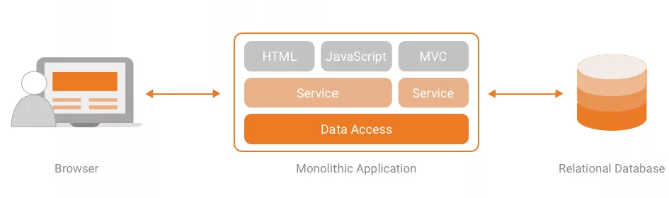
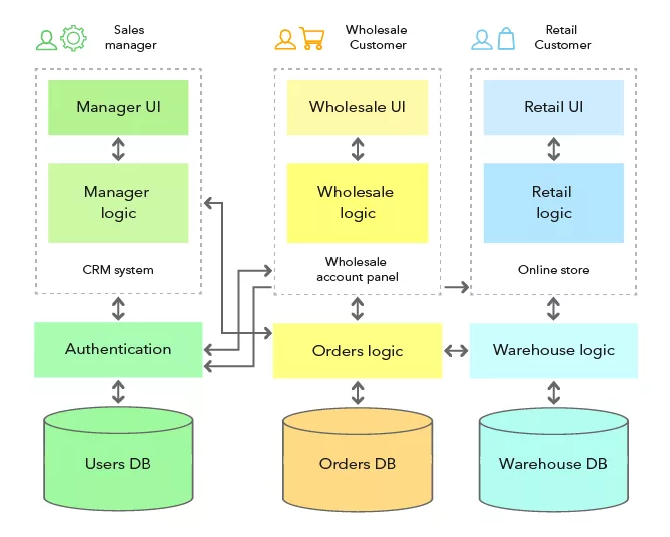

# Архитектура Веб-Приложений

Перед тем как начать разработку веб-приложения, важно понимать его архитектуру, иными словами, структуру и взаимосвязь
между компонентами приложения.

**Архитектура веб-приложения** - это структура, которая определяет логическую и физическую организацию компонентов, их
взаимодействие и методы связи для реализации веб-приложения[^1].

Представьте, что вам необходимо построить дом. Прежде чем начать строительство, вы должны разработать план дома,
определить количество комнат, их расположение, материалы и т.д. Точно так же и с веб-приложением. Прежде чем начать
разработку, необходимо определить структуру приложения, его компоненты и взаимосвязь между ними.

Перед тем как создавать веб-приложение вам необходимо определить следующие вопросы:
- **Какие компоненты будут входить в приложение?** Например, это может быть клиентская часть (Frontend), серверная часть
  (Backend), база данных и т.д.
- **Какие компоненты будут взаимодействовать между собой?** Например, клиентская часть будет взаимодействовать с серверной
  частью, серверная часть с базой данных и т.д.
- **Какие технологии будут использоваться для реализации приложения?** Например, для клиентской части это может быть HTML,
  CSS, JavaScript, для серверной части - PHP, для базы данных - MySQL и т.д.
- **Какие принципы и паттерны проектирования будут использоваться?** Например, это может быть паттерн MVC (Model-View-Controller),
  паттерн REST (Representational State Transfer) и т.д.

Пока некоторые слова могут показаться вам сложными и непонятными, но не переживайте, в дальнейшем мы разберем каждый.

## Типы архитектуры веб-приложений

В настоящее время существует множество различных типов архитектуры веб-приложений. Ниже приведены наиболее популярные из них:
- **Монолитная архитектура**
- **Сервисно-ориентированная архитектура (SOA)**
- **Микросервисная архитектура**

### Монолитная архитектура

**Монолитная архитектура** - это тип архитектуры, в котором все компоненты приложения находятся в одном месте[^2].

Все запросы от клиента обрабатываются на сервере, который в свою очередь отвечает на них. Все компоненты приложения находятся в одном месте и взаимодействуют друг с другом напрямую.

Это самый простой тип архитектуры, который хорошо подходит для небольших проектов. 

До этого вы, вероятно, имели дело с _монолитной архитектурой_, так как это самый простой и понятный тип архитектуры. В таком подходе используется единая кодовая база, один язык программирования, одна база данных и т.д. Это привычный вам формат веб-приложений, который вы разрабатывали ранее.

 [^3]

> [!NOTE]
> В нашем курсе мы будем использовать _монолитную архитектуру_ для разработки веб-приложений.

| Преимущества | Недостатки |
|--------------|------------|
| Простота разработки и развертывания | Сложность масштабирования |
| Единая кодовая база и стек технологий | Отсутствие гибкости и адаптивности |
| Меньше проблем с производительностью на начальном этапе | Сложность внесения изменений и тестирования |
| Централизованное управление данными и конфигурацией | Увеличение времени развертывания по мере роста приложения |
| Легкость мониторинга и отладки | Высокий риск отказа всего приложения при ошибке в одном из компонентов |

### Сервисно-ориентированная архитектура (SOA)

Рассмотрев недостатки выше описанной _монолитной архитектуры_, разработчики стали искать новые подходы к разработке веб-приложений, чтобы решить проблемы масштабируемости, гибкости и адаптивности. Одним из решений стала _сервисно-ориентированная архитектура (SOA)_.

**Сервисно-ориентированная архитектура (SOA)** - это тип архитектуры, в котором приложение разбивается на независимые сервисы, каждый из которых выполняет определенную функцию[^5].

Простыми словами, у вас работают несколько независимых сервисов, которые взаимодействуют друг с другом через сеть. Каждый сервис выполняет свою функцию и может быть развернут на отдельном сервере.

 [^4]

| Преимущества | Недостатки |
|--------------|------------|
| Гибкость и адаптивность | Сложность развертывания и управления множеством сервисов |
| Легкость масштабирования отдельных компонентов | Сложность мониторинга и отладки |
| Независимость разработки и развертывания | Увеличение сложности инфраструктуры |
| Повышенная устойчивость и отказоустойчивость | Потенциальные проблемы с производительностью из-за межсервисных взаимодействий |
| Возможность использования разных технологий и языков для разных сервисов | Усложнение координации между командами разработки |

Но с ростом количества пользователей, запросов и объема данных, _сервисно-ориентированная архитектура_ также стала иметь свои недостатки. Поэтому разработчики стали искать новые подходы к разработке веб-приложений.
Как итог, был разработан новый подход - _микросервисная архитектура_.

### Микросервисная архитектура

**Микросервисная архитектура** - это тип архитектуры, в котором приложение разбивается на маленькие независимые сервисы, каждый из которых выполняет определенную функцию[^6].

Многие могут подумать, что _микросервисная архитектура_ это то же самое, что и _сервисно-ориентированная архитектура_, но это не так. Основное отличие заключается в размере сервисов. В _микросервисной архитектуре_ сервисы должны быть максимально маленькими и независимыми.

В микросервисной архитектуре каждый микросервис обычно проектируется для выполнения одной конкретной задачи или функции, что обеспечивает его независимость и простоту масштабирования. В то время как традиционные сервисы могут объединять в себе несколько функций и не обязательно следовать принципу разделения обязанностей, присущему микросервисам. 

Например, в SOA (сервис-ориентированной архитектуре) сервис "Управление пользователями" может включать функции регистрации, аутентификации и управления профилем в одном сервисе. В микросервисной архитектуре отдельный микросервис будет отвечать только за аутентификацию пользователей, а другие микросервисы займутся регистрацией и управлением профилем.

Как и другие типы архитектуры, _микросервисная архитектура_ имеет свои преимущества и недостатки.

| Преимущества | Недостатки |
|--------------|------------|
| Гибкость и адаптивность | Сложность развертывания и управления множеством микросервисов |
| Независимое развертывание | Увеличенная сложность тестирования |
| Независимое масштабирование | Задержка сети при межсервисном взаимодействии |
| Повышенная отказоустойчивость | Сложность обеспечения целостности данных |
| Маленькие целевые команды | Требования к более сложной инфраструктуре |
| Использование разных технологий для каждого сервиса | Повышенные требования к мониторингу и логированию |
| Улучшенная поддержка и обновление | Потенциальное дублирование данных |
| Быстрое внедрение новых функций | Необходимость в управлении зависимостями между сервисами |
| Упрощенное управление кодовой базой | Более высокие затраты на разработку и поддержку |

[^1]: Web Application Architecture, medium.com [online]. Available: https://medium.com/geekculture/web-application-architecture-800d3ecd8019
[^2]: Monolithic Architecture: What, Why and When, medium.com [online]. Available: https://medium.com/swlh/monolithic-architecture-what-why-and-when-986dc5d5ce03
[^3]: Что такое монолитная архитетура, iaassaaspaas [online]. Available: https://iaassaaspaas.ru/terminologiya/chto-takoe-monolitnaya-arhitetura
[^4]: Monolith vs Microservices, evergreen.team [online]. Available: https://evergreen.team/
[^5]: What Is Service-Oriented Architecture? medium.com [online]. Available: https://medium.com/@SoftwareDevelopmentCommunity/what-is-service-oriented-architecture-fa894d11a7ec
[^6]: Microservices Architecture From A to Z? medium.com [online]. Available: https://medium.com/swlh/microservices-architecture-from-a-to-z-7287da1c5d28