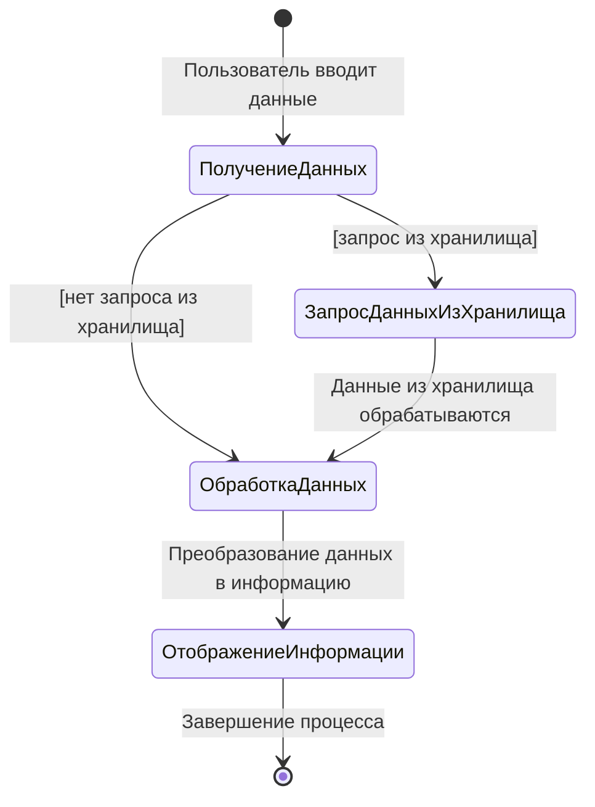

# Данные и информация

Вы, вероятно, часто слышали термины "*данные*" и "*информация*". Однако, несмотря на их частое использование в повседневной жизни, мы не всегда различаем их значения. Давайте разберемся, в чем заключается разница.

На самом деле существует множество мнений о том, что представляют собой данные и информация. Мы рассмотрим одно из них.

## Что такое данные?

**Данные** — это сырые, необработанные факты, которые сами по себе не имеют смысла. Это могут быть числа, текст, изображения или другие символы. Данные остаются неорганизованными и бесполезными до тех пор, пока они не будут структурированы или проанализированы. **Например**, список чисел или имен без пояснений — это просто данные.

## Что такое информация?

**Информация** — это данные, которые были обработаны и обрели смысл. Когда данные организованы, проанализированы и помещены в контекст, они становятся полезными для понимания и принятия решений. Например, если взять данные о посещаемости сайта и выявить тенденции роста или снижения трафика, это уже будет информация.

> [!NOTE]
> Информация помогает строить выводы, разрабатывать стратегии и принимать решения на основе анализа.

## Разница между данными и информацией

Главное отличие данных от информации заключается в том, что **данные** — это всего лишь **исходные факты**, в то время как **информация** — это р**езультат их обработки**.

> [!NOTE]
> Данные — это основа, которая после анализа превращается в информацию, пригодную для использования.

**Пример:**
- **Данные**: пользователи веб-сайта.
- **Информация**: количество пользователей, которые посетили сайт за последний месяц.

## Что нахоидтся в нашем приложении?

Как вы думаете, в нашем приложении содержатся данные или информация? **Ответ прост**: и данные, и информация. Данные — это то, с чем мы работаем, а информация — это результат обработки этих данных.

**Например**, одной из частых, но далеко не тривиальных задач веб-разработчика является обработка данных, полученных от пользователя, и их преобразование в информацию, которую можно отобразить на экране.

Данную схему можно представить следующим образом:

Таким образом, данные и информация взаимосвязаны и образуют целостную систему, которая позволяет нам создавать и использовать приложения.