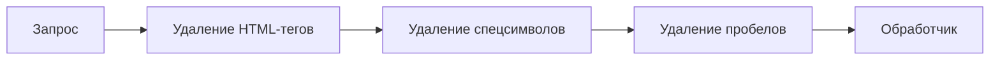
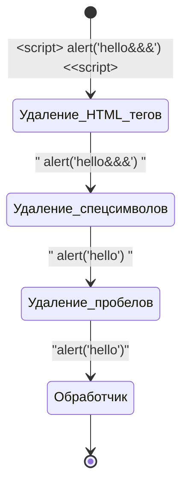

# Этапы обработки данных в веб-приложениях

**Управление данными** — это важнейший аспект работы веб-приложений, включающий обработку, хранение, защиту и контроль доступа к данным.

Веб-приложение получает данные от пользователей, обрабатывает их через различные механизмы, такие как фильтрация и валидация, и сохраняет их в базах данных или других хранилищах.

В этой главе мы рассмотрим, как данные проходят через приложение на каждом этапе, включая авторизацию — ключевой процесс контроля доступа.

## Как данные поступают в веб-приложение?

### Основные источники данных

1. **Ввод данных пользователем**: пользователи могут вводить информацию через формы на веб-страницах (например, регистрация, отправка комментариев).
2. **API-запросы**: внешние системы могут передавать данные через API для их обработки (например, запросы к сервисам погоды или оплаты).

Обычно данные передаются с помощью **HTTP-запросов** или других протоколов передачи данных.

## Этапы обработки данных

После поступления в веб-приложение данные проходят несколько этапов обработки, таких как фильтрация, валидация, проверка доступа (авторизация), сохранение и защита.

### Фильтрация данных

#### Определение

**Фильтрация данных** — это процесс очистки и подготовки входных данных перед их дальнейшим использованием в системе.

**Основная цель фильтрации** — удалить ненужные или потенциально опасные элементы из данных (например, лишние символы, HTML-теги, вредоносный код) и привести их к корректному формату.

#### Основные задачи фильтрации данных

- **Очистка от лишних символов**: удаление пробелов, HTML-тегов, спецсимволов.
- **Защита от вредоносных данных**: предотвращение инъекций, таких как SQL-инъекции и XSS (внедрение вредоносного кода).
- **Приведение данных к нужному формату**: преобразование строк в числа, приведение дат к стандартам, форматирование текста.

#### Middleware как паттерн для фильтрации

Самый распространенный способ фильтрации данных в веб-приложениях — использование **Middleware**.

**Middleware** — это паттерн, который позволяет обрабатывать данные на промежуточном этапе между получением запроса и его передачей в основную логику приложения. 

В контексте фильтрации данных middleware может служить механизмом для последовательной обработки данных до того, как они попадут обработчик.

**Пример использования Middleware в фильтрации**

Предположим, что входящие данные должны пройти несколько этапов фильтрации, таких как:

1. **Удаление HTML-тегов** для защиты от XSS-атак.
2. **Удаление специальных символов** для предотвращения SQL-инъекций.
3. **Приведение данных к корректному формату** (например, приведение строки к числовому типу).

Эти шаги могут быть реализованы через цепочку middleware, где каждый обработчик будет отвечать за свою часть фильтрации.

Например,

Таким образом, перед тем как данные попадут в контроллер, они проходят через несколько слоев фильтрации, каждый из которых обрабатывает данные на своём уровне.

### Валидация данных

#### Определение

**Валидация данных** — это процесс проверки данных на соответствие определенным правилам перед их использованием или сохранением.

Если фильтрация удаляет нежелательные элементы, то валидация проверяет, являются ли данные корректными.

**Например**, если вы ожидаете, что пользователь введет email-адрес, то фильтрация данных может очистить его от лишних символов, а валидация проверит, что введенный адрес соответствует стандартам электронной почты.

#### Основные задачи валидации.

- **Проверка формата**: убедиться, что данные соответствуют заданному формату (например, проверка адреса электронной почты).
- **Проверка обязательных полей**: проверка наличия всех обязательных данных.
- **Проверка диапазонов**: убедиться, что данные находятся в допустимом диапазоне (например, возраст от 18 до 65 лет).

Примеры валидации включают проверку форматов дат, адресов электронной почты или уникальности данных.

## Проверка доступа (Авторизация)

### Определение

**Авторизация** — это процесс проверки прав пользователя или системы на доступ к определённым данным или действиям.

Она выполняется после аутентификации (проверки личности пользователя) и служит для ограничения доступа к ресурсам в зависимости от прав.

### Зачем нужна авторизация?

Авторизация гарантирует, что только те пользователи, которым это разрешено, могут просматривать, изменять или удалять данные. Это помогает предотвратить несанкционированный доступ и защищает как данные пользователей, так и само приложение.

### Как работает авторизация?

Авторизация может быть реализована через несколько механизмов:
1. **Роли и права**: пользователям назначаются роли (например, администратор, редактор, пользователь), и каждому уровню ролей предоставляется определенный доступ к данным.
2. **Политики доступа**: более гибкий механизм, который позволяет назначать права доступа к данным в зависимости от контекста (например, владелец данных может редактировать их, а другие пользователи только просматривать).

## Хранение данных

После успешной фильтрации, валидации и проверки доступа данные сохраняются в одном из хранилищ приложения или отображение данных пользователю.

### Определение

**Хранение данных** — это процесс записи данных в долговременное хранилище для последующего использования. Это может быть база данных, файловая система или облачное хранилище.

Типы хранилищ данных:
- **Реляционные базы данных** (например, MySQL, PostgreSQL) для структурированных данных.
- **NoSQL базы данных** (например, MongoDB) для неструктурированных данных.
- **Файловые системы** для хранения больших файлов (например, изображений или видео).
- **Кэш** для временного хранения данных.

## Защита данных

Защита данных включает меры для предотвращения несанкционированного доступа и утечки данных.

#### Основные аспекты защиты данных:

1. **Шифрование**: защита данных при передаче и хранении (например, использование HTTPS для передачи данных или шифрование паролей в базе данных).
2. **Контроль доступа**: использование авторизации для ограничения прав на доступ к данным.
3. **Журналирование и аудит**: запись всех действий, связанных с доступом к данным, для предотвращения утечек и нарушения безопасности.

## Отображение данных

После обработки и хранения данных в приложении они могут быть отображены пользователю через интерфейс приложения.

**Отображение данных** — это процесс представления данных в удобной форме для пользователя. Это может быть в виде таблиц, графиков, диаграмм или других элементов интерфейса.

## Заключение

В целом, наше приложение можно описать как последовательность этапов обработки данных, где каждый этап играет ключевую роль в обеспечении безопасности и целостности информации.