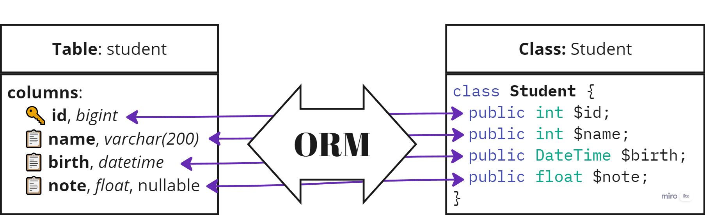

# ORM

Прежде чем перейти к следующему разделу, давайте рассмотрим, что такое ORM и почему этот паттерн широко используется в разработке программного обеспечения.

**ORM** (Object-Relational Mapping) — это паттерн проектирования, который позволяет взаимодействовать с базой данных через объектно-ориентированный подход [^1].

С помощью ORM данные в базе данных представляются в виде объектов, что значительно упрощает процесс работы с ними, позволяя разработчикам использовать привычные методы объектно-ориентированного программирования для выполнения операций с базой данных.

Этот подход особенно популярен в веб-разработке, поскольку большинство современных фреймворков поддерживают и используют ORM для упрощения работы с базами данных.

## Преимущества и недостатки ORM [^2]

| Преимущества ORM                          | Недостатки ORM                              |
|-------------------------------------------|---------------------------------------------|
| Упрощение работы с базой данных           | Может снижать производительность            |
| Ускорение процесса разработки             | Не всегда понятно, что происходит "под капотом" |
| Повышение безопасности при работе с данными | Может быть сложно оптимизировать запросы     |
| Читаемость и поддерживаемость кода        | Может не подходить для работы с большими объемами данных |

## Как работает ORM

Представим, что у нас есть таблица `users` в базе данных:

```sql
CREATE TABLE users (
    id SERIAL PRIMARY KEY,
    name VARCHAR(255),
    email VARCHAR(255)
);
```

Чтобы получить всех пользователей из этой таблицы, стандартный SQL-запрос будет выглядеть так:

```php
$users = $pdo->query('SELECT * FROM users')->fetchAll();
```

Этот подход работает напрямую с базой данных, но требует ручной обработки данных.

С ORM, напротив, мы можем представить таблицу `users` в виде объекта. Для этого создается класс `User`, который будет отображать каждую строку таблицы как объект:

```php
class User
{
    public $id;
    public $name;
    public $email;
}
```

Теперь, выполняя запрос, мы получим объекты класса `User` вместо массивов данных:

```php
$users = // Получаем всех пользователей из базы данных

foreach ($users as $user) {
    echo $user->name; // Выводим имя пользователя
}
```

Благодаря ORM, работа с базой данных становится более интуитивной, так как мы манипулируем объектами, а не сырыми данными, что делает код более понятным и удобным в сопровождении. 

Схематически данный паттерн можно отобразить следующим образом:



## Маппинг объектов

Процесс сопоставления объектов с данными в базе данных называется **маппингом** (**mapping**).

Маппинг позволяет перевести данные **из базы данных в объекты и наоборот**.

ORM-фреймворки обычно предоставляют инструменты для создания таких маппингов, что позволяет разработчикам **сосредоточиться на бизнес-логике приложения**, **а не на деталях взаимодействия с базой данных**.

Хоть и у ORM есть свои недостатки, в большинстве случаев **преимущества перевешивают недостатки**, особенно при работе с небольшими и средними проектами.

## Заключение

**ORM (Object-Relational Mapping)** является ключевым паттерном в разработке программного обеспечения.

Благодаря ORM разработчики могут работать с базами данных через объектно-ориентированный подход, что упрощает процесс взаимодействия с данными.

Основные преимущества ORM — это простота использования, повышение безопасности и ускорение разработки. Несмотря на некоторые недостатки, такие как снижение производительности или сложности с оптимизацией запросов, ORM значительно облегчает работу с данными, делая код более понятным и поддерживаемым.

В большинстве случаев преимущества ORM оправдывают его использование, особенно в небольших и средних проектах, где гибкость и скорость разработки имеют приоритет.

[^1]: What is an ORM – The Meaning of Object Relational Mapping Database Tools, freeCodeCamp [online]. URL: https://www.freecodecamp.org/news/what-is-an-orm-the-meaning-of-object-relational-mapping-database-tools/.

[^2]: D. Torres, Cons and Pros - ORM (Object-Relational Mapping). March 26, 2023 [online]. URL: https://www.linkedin.com/pulse/cons-pros-orm-object-relational-mapping-daniel-torres/